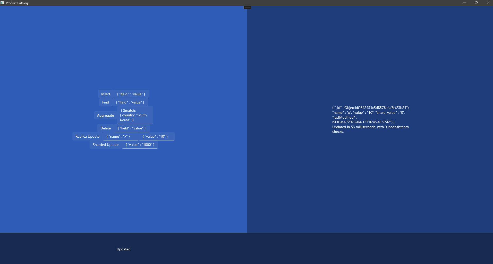

## Transazioni MongoDB

Atomicità delle transazioni in un Mongo-Cluster
<br>
<p class="small-text">Progetto per il corso di New Generation Databases</p>
<p class="small-text">Baioni Francesco</p>
<p class="small-text">Caprari David</p>


---

- Cluster MongoDB
  - Configurazioni dei nodi
  - Script inizializzazione
- Applicazione interfaccia grafica
  - Semplice GUI (WinUI)
  - Backend con interfaccia al driver

---

## Cluster MongoDB
- MongoDB <span style="color:green"> 6.0.2 </span>
- MongoS <span style="color:green"> 6.0.2 </span>
- MongoShell

---
#### Struttura interna

- Shard A
- Shard B

Ogni shard composto da 3 Replica Set
In locale (localhost:porta)

---
#### Struttura interna


---
#### Dati
Singola collezione di due documenti

Documento **Y** --> Shard A
Documento **X** --> Shard B

```json
{
    "_id": ObjectId("..."),
    "name": "x",
    "value": "10",
    "shard_value": "0",
    "lastModified": "ISODate("aaaa-mm-ggT:...")",
    "field": "0"
}
```

---

## Applicazione WinUI
- VisualStudio2022
- Framework XAML/C# WinUI3

---

## Interfaccia al DB
Funzioni base:
- Inserimento
- Ricerca
- Aggregazione
- Cancellazione

Funzioni avanzate:
- **Replica Update**
- **Sharded Update**

---
#### <span style="color:white">Inserimento</span>
<br>
<br>
<br>
<br>
<br>
<br>
<br>


---
#### <span style="color:white">Ricerca
<br>
<br>
<br>
<br>
<br>
<br>
<br>


---
#### <span style="color:white">Aggregazione
<br>
<br>
<br>
<br>
<br>
<br>
<br>


---
#### <span style="color:white">Cancellazione
<br>
<br>
<br>
<br>
<br>
<br>
<br>


---

#### Replica Update
- Aggiornamento asincrono attraverso MongoS (localhost:27030) del "value" nel documento X
- Contemporaneo check di consistenza dell'aggiornamento attraverso ReplicaSet secondario (localhost:27025)

---
#### Replica Update


---


#### <span style="color:white">Replica Update
<br>
<br>
<br>
<br>
<br>
<br>
<br>



---

#### Replica Update

**Replica delle transazioni interne allo shard è atomica**

MongoDB $\geq$ <span style="color:green">4.2</span> supporta Multi-Document transactions

---

#### Sharded Update
- **Transazione asincrona a MongoS:**
   1. Transazione di aggiornamento del "value" nel documento Y
   2. Attesa di 1sec
   3. Transazione di aggiornamento del "value" nel documento X

- **Check contemporaneo di vincolo di integrità**
<span style="color:darkgrey">"value@X"=="value@Y" </span>

---

#### Sharded Update


---

#### <span style="color:white">Sharded Update
<br>
<br>
<br>
<br>
<br>
<br>
<br>


---
#### Sharded Update

**La singola sessione  <span style="color:red">NON</span> è atomica**

Le transazioni che coinvolgono più di uno shard all'interno della stessa sessione non sono atomiche

---

#### Phantom Update
1. Transazione di **ricerca** che coinvolga **tutti** i documenti del cluster (a MongoS)
   - Verifica che il campo value dei documenti trovati sia costante 
2. Contemporanea transazione di **update** su **tutti** i documenti del cluster (a MongoS)

---

#### Phantom Update
- Con l'utilizzo di timestamp verifichiamo che ci sia concorrenza tra le due transazioni
- Verificata la concorrenza effettuiamo un check sul **vincolo di integrità**: campo value uguale tra tutti i documenti

---

#### <span style="color:white">Phantom Update
<br>
<br>
<br>
<br>
<br>
<br>
<br>


---

#### Phantom Update
Quando c'è concorrenza non c'è mai anomalia di Aggiornamento Fantasma

---
### Conclusioni
- Transazioni definiscono lock condivisi ed esclusivi su tutti i server del cluster coinvolti in transazioni multi-documento
- Lock garantiscono **atomicità** e **gestione concorrenza**
---

# Grazie per l'attenzione

---

### Post-Notes:
1. Bug multi-istanza nello stesso host
2. Codice Replica Update
3. Codice Sharded Update
4. Codice Phantom Update

---

#### Replica Update
```csharp
private async void ReplicaUpdateButton_Click(object sender, RoutedEventArgs e)
    {
        ...
        using (var session = GetConnectionClient().StartSession())
        {
            ...
            IMongoCollection<BsonDocument> collection_sharded = database_sharded.GetCollection<BsonDocument>("sharded_coll");
            var filter = Builders<BsonDocument>.Filter.Eq(ToUpdateTextBox.Text.Split("\"")[1], ToUpdateTextBox.Text.Split("\"")[3]);
            var resFilter = collection.Find(filter).FirstOrDefault();
            if (resFilter != null)
            {
                ...
                var update = Builders<BsonDocument>.Update.Set(new_key, new_value).CurrentDate("lastModified");
                try
                {
                    await collection.UpdateManyAsync(filter, update);
                    connectionBlock.Text = "Updated";
                    var checks = 0;
                    DateTime now = DateTime.Now;
                    bool checked_replica_copy = false;
                    try
                    {
                        while (!checked_replica_copy && checks < 1000)
                        {
                            var resDocument = collection_sharded.Find(filter).FirstOrDefault();
                            if (resDocument != null)
                            {
                                if (resDocument[new_key].Equals(new_value))
                                {
                                    checked_replica_copy = true;
                                    DateTime new_now = DateTime.Now;
                                    now = resDocument["lastModified"].ToLocalTime();
                                    ResultTextBlock.Text = resDocument.ToString() + /
                                                        "\nUpdated in " + (new_now.Millisecond + new_now.Second * 1000 - now.Millisecond - now.Second * 1000).ToString() /
                                                        + " milliseconds, with " + checks.ToString() /
                                                        + " inconsistency checks.";
                                }
                                else { checks++; }
                            }
                        ...                                    
                        }
                        if (checks >= 1000)
                        {
                            ResultTextBlock.Text = "More than 1000 inconsistency checks. Are you on the correct shard? (Actually on " + new_connection_string + ").";
                        }
        }
    }
```

---

#### Sharded Update - ext

```csharp
private async void ShardedUpdateButton_Click(object sender, RoutedEventArgs e)
    {
        ...
        using (var session = GetConnectionClient().StartSession())
        {
            ...
            var new_key = ShardedUpdatedTextBox.Text.Split("\"")[1];
            var new_value = ShardedUpdatedTextBox.Text.Split("\"")[3];-
            if (resFilterX != null && resFilterY != null)
            {
                DateTime now = DateTime.Now;
                session.StartTransaction();
                ShardedUpdateAsync(collection, new_key, new_value);
                var checks = 0;
                int num_checks = 100; //Number of consistency checks scheduled
                while (checks < num_checks)
                {
                    var x = collection_shardB.Find(filterX).First();
                    var y = collection_shardA.Find(filterY).First();
                    if (y["value"] == x["value"])
                    {
                        DateTime new_now = x["lastModified"].ToLocalTime();
                        ResultTextBlock.Text = "Updated in " / 
                        + (new_now.Millisecond + new_now.Second * 1000 - now.Millisecond - now.Second * 1000).ToString() /
                        + " milliseconds, with " + checks.ToString() + " inconsistency checks.";
                        break;
                    }
                    else
                    {
                        checks++;
                        await Task.Delay(100);
                    }
                }
                if (checks >= num_checks)
                {    ResultTextBlock.Text = "Check resulted in more than " + checks.ToString() + " consistency checks failed.";    }
            }
        ...
        }
    }
```

---

#### Sharded Update - transaction
```csharp
private async Task ShardedUpdateAsync(IMongoCollection<BsonDocument> collection, string new_key, string new_value)
    {
    
        collection.UpdateMany(Builders<BsonDocument>.Filter.Eq("name", "y"), /
                                                    Builders<BsonDocument>.Update.Set(new_key, new_value)/
                                                    .CurrentDate("lastModified"));
        await Task.Delay(1000);
        collection.UpdateMany(Builders<BsonDocument>.Filter.Eq("name", "x"), /
                                                    Builders<BsonDocument>.Update.Set(new_key, new_value)/
                                                    .CurrentDate("lastModified"));
        connectionBlock.Text = "Updated";
    }
```
---

#### Phantom Update - ext
```csharp
private async void PhantomUpdateButton_Click(object sender, RoutedEventArgs e)
{
    ...
    using (var session = GetConnectionClient().StartSession())
    {
        ...
        collection.UpdateMany(Builders<BsonDocument>.Filter.Eq("field", "0"), Builders<BsonDocument>.Update.Set("value", 0).CurrentDate("lastModified"));
        // Set tutti value a 0
        var task1 = FirstTransaction(collection);
        DateTime second_start = DateTime.Now;
        var task2 = SecondTransaction(collection, new_value);
        await Task.WhenAll(task1, task2);
        if (task1.Result.date.CompareTo(second_start) >= 0 || task1.Result.date.CompareTo(task2.Result) >= 0) 
        //Fine prima transazione successiva a inizio seconda OPPURE fine prima successiva a fine seconda => CONCORRENTI
        {
            List<BsonDocument> documentList = new List<BsonDocument>();
            foreach (var document in task1.Result.resFilter)
            { documentList.Add(document); }
            if (documentList[0]["value"] == documentList[1]["value"])
            { ResultTextBlock.Text = documentList[0].ToString() + "\n" + documentList[1].ToString() + "Constraint respected eventhough there was concurrency in transactions!"; }
            else
            { ResultTextBlock.Text = documentList[0].ToString() + "\n" + documentList[1].ToString() + "Constraint NOT respected, Phantom Update!"; }
        }
        else
        { ResultTextBlock.Text = "Concurrency not registered, both values are set to: " + new_value.ToString();
            connectionBlock.Text = "Updated"; }
    }
}
```
---

#### Phantom Update - transactions
```csharp
private async Task<(DateTime date, System.Collections.Generic.List<BsonDocument> resFilter)> FirstTransaction(IMongoCollection<BsonDocument> collection)
{
    var resFilter = await collection.Find(Builders<BsonDocument>.Filter.Eq("field", "0")).ToListAsync();

    return (DateTime.Now, resFilter);
}

private async Task<DateTime> SecondTransaction(IMongoCollection<BsonDocument> collection, string new_value)
{
    await collection.UpdateManyAsync(Builders<BsonDocument>.Filter.Eq("field", "0"), Builders<BsonDocument>.Update.Set("value", new_value).CurrentDate("lastModified")); 
    // parte ma non si attende il termine
    
    return DateTime.Now;
}
```